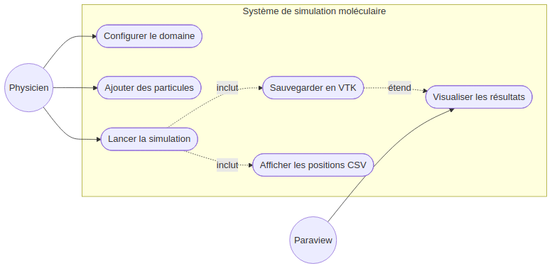
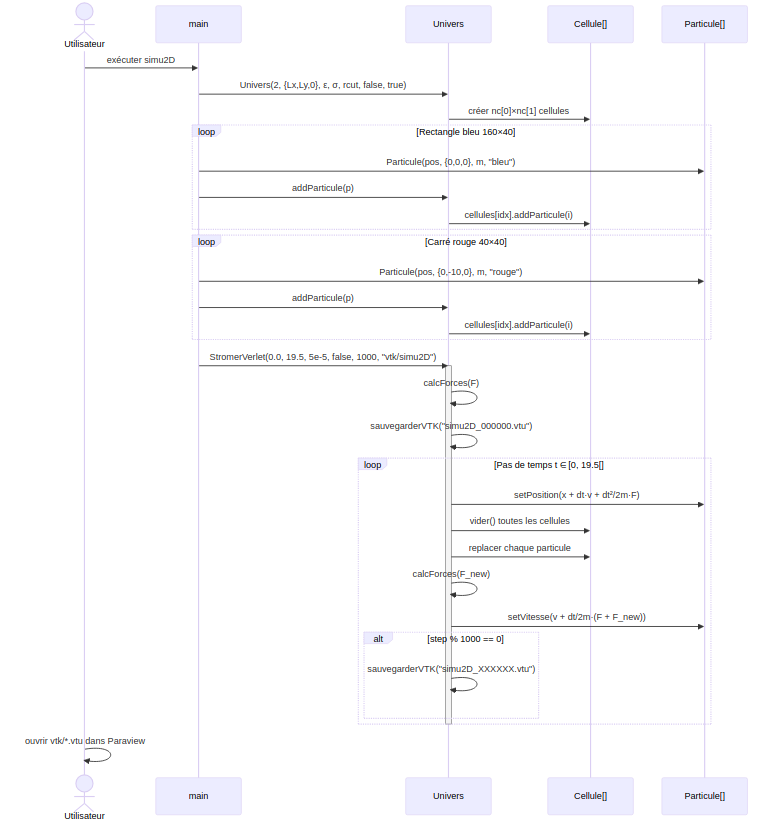
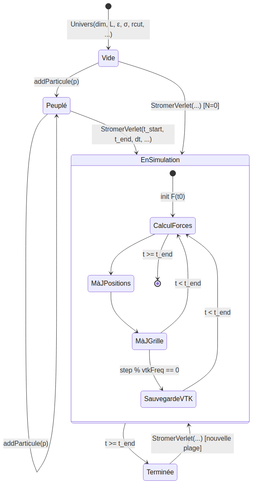
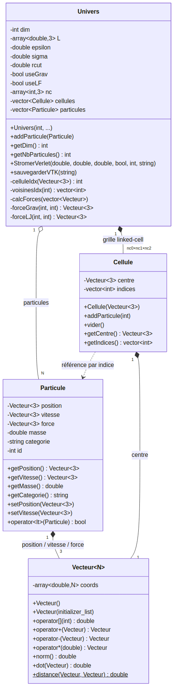

# Lab 5 — ACVL : Modélisation UML

## Q4 — Diagramme des cas d'utilisation

**Acteurs :**

- **Physicien/Utilisateur** : instancie `Univers`, ajoute des `Particule`, déclenche `StromerVerlet`.
- **Paraview** : logiciel externe qui consomme les fichiers `.vtu` pour visualiser les trajectoires.

**Cas d'utilisation principaux :**

| Cas | Description |
|-----|-------------|
| Configurer le domaine | Créer `Univers` avec `dim`, `L`, `epsilon`, `sigma`, `rcut`, flags forces |
| Ajouter des particules | Appeler `addParticule(p)` pour chaque `Particule` initiale |
| Lancer la simulation | Appeler `StromerVerlet(t_start, t_end, dt, ...)` |
| Sauvegarder en VTK | `sauvegarderVTK(filename)` généré automatiquement toutes les `vtkFreq` itérations |
| Afficher les positions CSV | Impression sur stdout à chaque pas si `afficher = true` |
| Visualiser les résultats | Ouvrir les `.vtu` dans Paraview ; coloration par vitesse/masse |

---

## Q5 — Diagramme de séquence

---

## Q6 — Diagramme de transitions d'états

**Description des états :**

| État | Description |
|------|-------------|
| **Vide** | `Univers` créé, grille initialisée, aucune particule |
| **Peuplé** | Au moins une particule ajoutée ; grille à jour |
| **EnSimulation** | `StromerVerlet` en cours ; positions/vitesses/forces évoluent à chaque pas |
| **Terminée** | `StromerVerlet` a atteint `t_end` ; état interne lisible |

---

## Q7 — Diagramme de classes d'analyse

**Relations clés :**

| Relation | Type | Explication |
|----------|------|-------------|
| `Particule` → `Vecteur<3>` | Composition | Position, vitesse et force sont des `Vecteur<3>` détenus par la particule |
| `Cellule` → `Vecteur<3>` | Composition | Le centre géométrique est un `Vecteur<3>` immuable |
| `Univers` → `Particule` | Agrégation | `Univers` possède le vecteur de particules (durée de vie liée) |
| `Univers` → `Cellule` | Composition | La grille est créée et détruite avec `Univers` |
| `Cellule` ⇢ `Particule` | Association indirecte | `Cellule` stocke des *indices* entiers, évitant l'invalidation lors du redimensionnement du vecteur |
